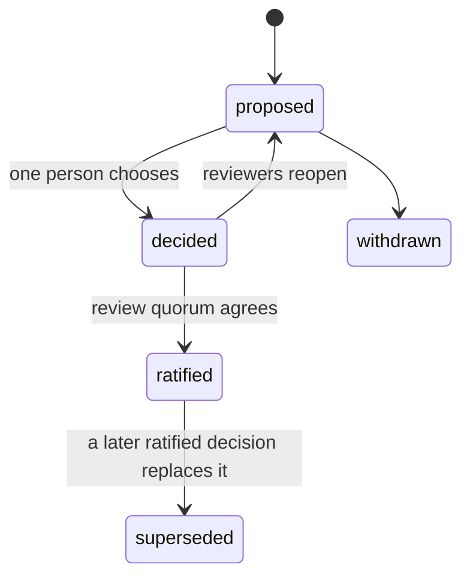

# Decision states

From [#2555](https://github.com/INTENTIUS/chant/issues/2555#decision-states). The `state` field of each file in [decisions/](decisions/README.md) holds one of these values.

| State | Meaning | Sealed |
|---|---|---|
| proposed | options and a recommendation, no choice yet | no |
| decided | chosen by one person; provisional | no; amendments keep history |
| ratified | reviewed and agreed by a quorum of distinct people | yes (#2524 D4) |
| superseded | replaced by a later ratified decision | stays sealed |
| withdrawn | dropped before a choice | no |

Only a ratified decision constrains other work. Work may build on a `decided` one, but its link shows the dependency is provisional.

Every #2524 decision starts in `decided`, because one maintainer chose each of them alone. Seals and signing don't exist yet, so for now `ratified` is recorded by merging a pull request with the review quorum, as #2555 describes under First use.
