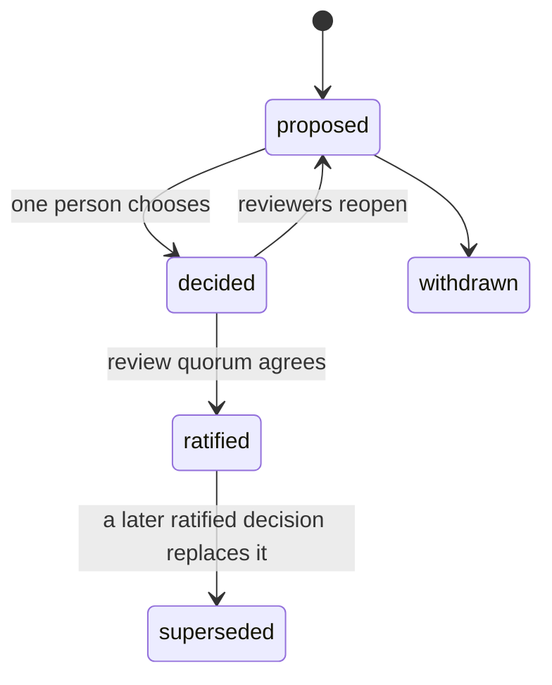

# Decision states

From [#2555](https://github.com/INTENTIUS/chant/issues/2555#decision-states). The `state` field of each file in [decisions/](decisions/README.md) holds one of these values.

```mermaid
stateDiagram-v2
  [*] --> proposed
  proposed --> decided: one person chooses
  decided --> ratified: review quorum agrees
  decided --> proposed: reviewers reopen
  ratified --> superseded: a later ratified decision replaces it
  proposed --> withdrawn
```

| State | Meaning | Sealed |
|---|---|---|
| proposed | options and a recommendation, no choice yet | no |
| decided | chosen by one person; provisional | no; amendments keep history |
| ratified | reviewed and agreed by a quorum of distinct people | yes: `closed_digest`, written as it enters the state ([ws-063](decisions/ws-063-seal-and-review-digest.md)) |
| superseded | replaced by a later decision | yes, the same way when an amendment sets the state; a ratified decision a later one replaces keeps its file, state and seal, and readers see the replacement in `supersededBy` |
| withdrawn | dropped before a choice | no |

Only a ratified decision constrains other work. Work may build on a `decided` one, but its link shows the dependency is provisional.

Every #2524 decision starts in `decided`, because one maintainer chose each of them alone. A person ratifies one once its quorum is met, by setting `state` to `ratified` with `chant workspace records amend`, and commits that in a pull request. The decision kind names `ratified` in `reviews.ratified`, so chant refuses the amendment with `ratify-quorum-not-met` while the quorum is not met, and leaves `state` and `closed_digest` out of the digest so the verdicts still count once it is ratified and sealed (#2873, ws-063). chant never changes the state by itself, and a review only adds a verdict.
