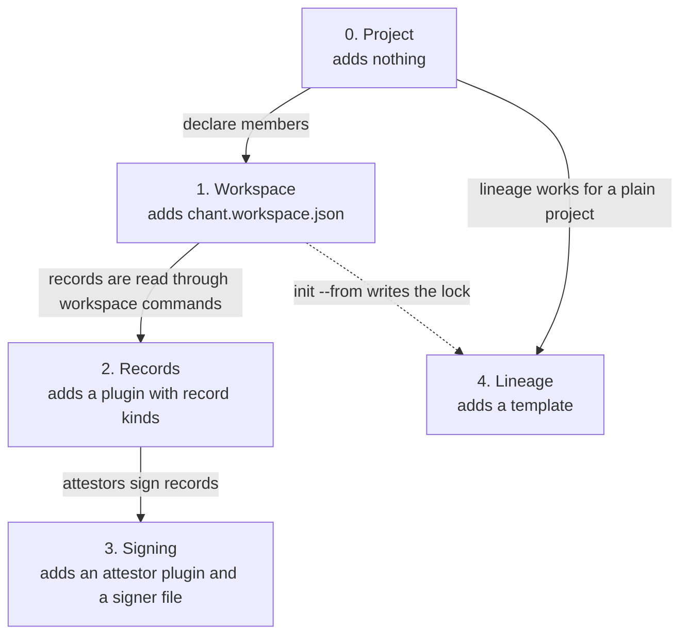

# Workspace levels of use

From [#2524 D0](https://github.com/INTENTIUS/chant/issues/2524#d0-levels-of-use-all-opt-in) and the driver [#2525](https://github.com/INTENTIUS/chant/issues/2525). Each level is opt-in, and a project that adds nothing stays at level 0 with today's chant.

| Level | You add | You get |
|---|---|---|
| 0. Project | nothing | today's chant |
| 1. Workspace | `chant.workspace.json` | members, member links, `chant workspace …` commands, per-member ledgers, per-member CI, a lock when made from a template, one read contract |
| 2. Records | a plugin with record kinds | typed records, seals, the spec query, record links |
| 3. Signing | an attestor plugin and a signer file | verified authorship |
| 4. Lineage | a template | migrations and `chant workspace upgrade` (the lock itself is written from level 1) |

An arrow means the lower level is needed first. Levels depend on each other only where they must (the Order rule in D0), so level 4 has an edge from level 0 as well as from level 1.

The rules every level is held to are in #2525: only the file creates a workspace, level 0 output stays identical apart from listed and warned changes, and project commands keep project meaning at a declared root.
